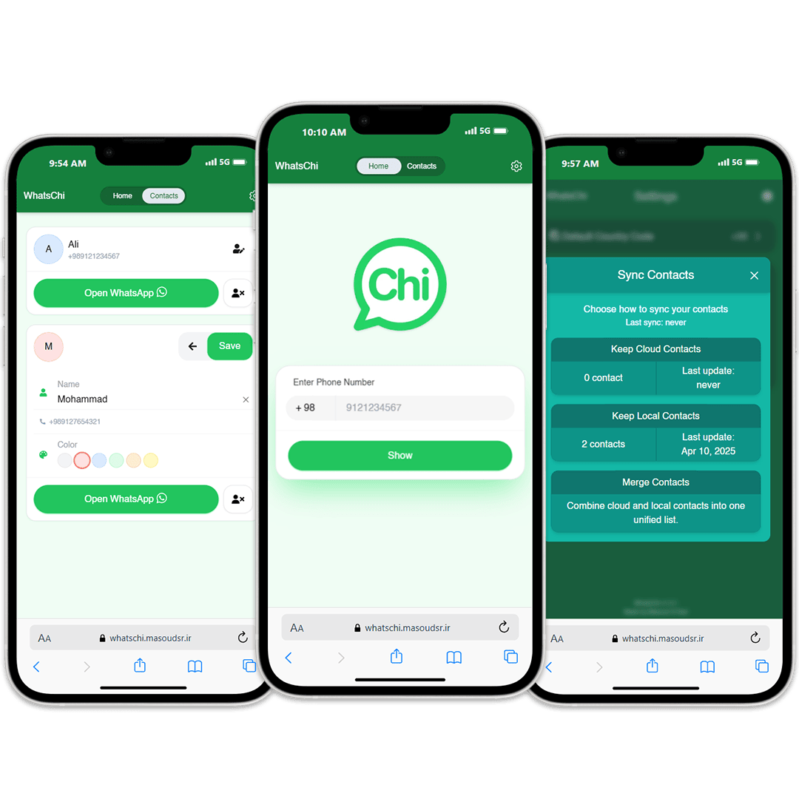

# 📱 WhatsChi: WhatsApp Contact Manager

WhatsChi is a web app that lets you open a WhatsApp chat with any phone number — without saving it to your phone contacts.

## Features:

🟢 Open WhatsApp chats directly by entering a phone number.
💾 Save and manage your favorite numbers inside the app.
☁️ Sync contacts to the cloud (optional).
🔄 Choose between local-only, cloud-only, or merged contact sync.
⚡ Fast, lightweight, and fully usable on web.

## Technologies Used:

- Next.js
- React.js
- MongoDB
- Mongoose
- NextAuth.js
- RESTful API (with Next.js API Routes)
- nanoid
- React Icons
- Tailwind CSS

## 🌐 Try it out

[whatschi.masoudsr.ir](https://whatschi.masoudsr.ir/)
